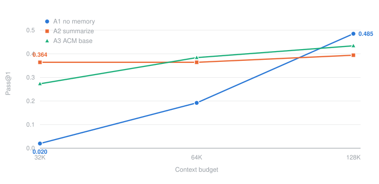

# Agent Memory Management on SWE-Bench

Does giving a coding agent explicit control over its own context actually help?
This repo runs that experiment end to end: open-weight models served with vLLM on
UW's Tillicum H200 cluster, agents driven through SWE-Bench Verified, and patches
scored in Apptainer sandboxes on Klone.

Three memory policies are compared under an identical model, sampling
configuration and context budget, so the only thing that varies is the policy.

| arm | what it does |
|---|---|
| **A1** no memory | plain ReAct. Context grows until it hits the budget and the run dies |
| **A2** summarize | the harness compresses history once a threshold is crossed |
| **A3** ACM base | the agent gets `manage_context` and `query_memory` as real tools and decides for itself. This is the untrained baseline from [ACM](https://arxiv.org/abs/2607.23809) |

## What we found

The value of context management is not a fixed property of the method. It depends
on how tight the budget is, and it changes sign.

<p align="center"></p>

At a 32K budget the baseline resolves 2 of 99 instances while memory resolves 27
to 36. At 128K the baseline overtakes both. ACM report a single operating point at
128K, which is the end of the curve where the mechanism has least to do.

Two supporting results. Our 128K baseline lands at 0.485 against the 0.489 ACM
report for the same model, which is a useful check that the pipeline is sound.
And across every run only 2 compressions out of more than a thousand were
voluntary, so these models do not manage their own context unless pushed.

### Three models at a 64K budget

| | Pass@1 | Tools | Steps | Peak | Final | Edits | Sub. | OOC |
|---|--:|--:|--:|--:|--:|--:|--:|--:|
| **Gemma-4-12B-it** | | | | | | | | |
| A1 no memory | 0.293 | 71.7 | 71.1 | 35K | 35K | 0 | 62 | 27 |
| A2 summarize | 0.273 | 89.1 | 88.2 | 32K | 26K | 0.58 | 85 | 0 |
| A3 ACM base | **0.384** | 94.6 | 93.8 | 39K | 29K | 0.48 | 82 | 3 |
| **MiMo-V2.6-Distill-Qwen-9B** | | | | | | | | |
| A1 no memory | 0.121 | 143.3 | 129.6 | 57K | 57K | 0 | 20 | 59 |
| A2 summarize | 0.212 | 209.3 | 190.5 | 54K | 27K | 1.54 | 30 | 0 |
| A3 ACM base | **0.263** | 199.6 | 183.4 | 54K | 28K | 0.70 | 37 | 2 |
| **Qwen3.5-9B** | | | | | | | | |
| A1 no memory | 0.172 | 123.7 | 123.4 | 57K | 57K | 0 | 30 | 66 |
| A2 summarize | **0.374** | 176.6 | 175.7 | 54K | 35K | 1.12 | 59 | 0 |
| A3 ACM base | 0.303 | 182.9 | 182.4 | 54K | 37K | 1.00 | 48 | 5 |

99 instances per cell. `Peak` is bounded by the compression trigger for A2 and A3
and by the context wall for A1, so `Final` is the column that shows what memory
actually does. Memory removes out-of-context failures almost entirely and roughly
doubles the number of submitted patches.

## Running it

Serving and the agent loop run on Tillicum. Scoring runs on Klone, where
SWE-Bench images are prebuilt once as Apptainer SIFs so a scoring round never
touches Docker Hub.

```bash
# one model, all three arms
bash scripts/launch_arms.sh configs/models/qwen35-9b.env

# a single instance first, which is always worth doing
INSTANCE_IDS=astropy__astropy-13236 bash scripts/launch_arms.sh configs/models/qwen35-9b.env acm

bash scripts/track_runs.sh          # live progress across jobs
```

Scoring, then the paper table and figure:

```bash
sbatch --export=ALL,PREDS=runs/<run>/preds.json,RUN_ID=<run>,KEEP_SIF=1 \
  scripts/run_apptainer_eval.slurm

python3 scripts/make_table.py --run-dir "runs/<glob>" --eval logs/apptainer_eval \
  --tex paper/table.tex --md paper/table.md
```

## Layout

```
scripts/memory_agent.py      the three policies, token accounting, ACM tool handlers
scripts/run_memory_swebench.py  driver, a trimmed mini-swe-agent swebench runner
scripts/serve_and_run_swebench.slurm   serve vLLM and drive the agent in one job
scripts/run_apptainer_eval.*    sandboxed scoring on Klone
scripts/make_table.py        paper tables, ACM's layout with their rows for reference
scripts/render_trajectory_html.py   one run as a readable page with a context chart

configs/models/*.env         one file per model and budget, the only thing that
                             differs between arms is MEMORY_POLICY
configs/mem_subset_99.txt    the evaluation subset

paper/                       results section, tables, figure
report.md                    findings log, including the ones that did not work
plan.md                      running decision log
logs/                        Slurm output, kept in git since cluster scratch is purged
```

## Notes

Token counting uses the served model's own tokenizer through vLLM's `/tokenize`
endpoint, so thresholds are exact rather than estimated. Every scoring run ends
with a sandbox check, because an overlay collision once corrupted 70% of patch
applications and was only caught by reading logs by hand.

`report.md` keeps the failures as well as the results. Several early numbers were
wrong for reasons worth remembering, including a build that asked models to issue
`manage_context` as a bash string rather than a registered tool, which they
ignored entirely and which made forced compliance look like zero.
